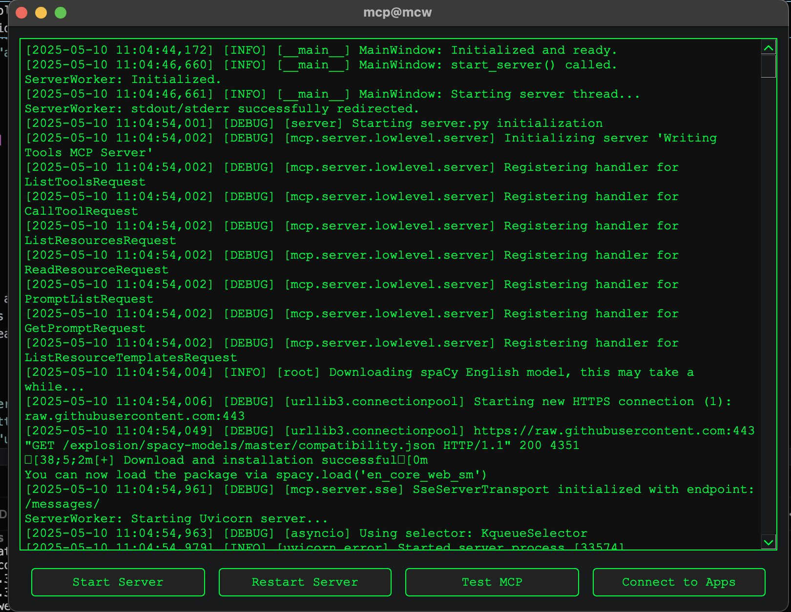

# Writing Tools MCP Server

This is a Model Context Protocol (MCP) server designed to provide various text analysis tools, assisting users in improving their writing. It can be integrated with AI assistants like Claude or development environments like Cursor to analyze text directly within your workflow.

MCP servers act as a secure bridge or interface, enabling AI models and language assistants to interact with local applications, tools, or data on a user's machine. This server leverages that protocol to offer its specialized writing-specific analysis capabilities to connected AI clients.



## Features

This server provides the following text analysis tools:

*   **`list-tools`**: List all available tools in this server.
*   **`character-count`**: Return the number of characters in the input text.
*   **`word-count`**: Return the number of words in the input text.
*   **`spellcheck`**: Return a list of misspelled words in the input text.
*   **`readability-score`**: Return readability scores (Flesch, Kincaid, Fog) for the text, section, or paragraph level.
*   **`reading-time`**: Return the estimated reading time for the text, section, or paragraph level.
*   **`keyword-density`**: Calculate the density of a given keyword in the text.
*   **`keyword-frequency`**: Count how often each keyword appears in the text (optionally removing stopwords).
*   **`top-keywords`**: Identify the most frequently used keywords in the text.
*   **`keyword-context`**: Extract sentences or phrases where a specific keyword appears.
*   **`passive-voice-detection`**: Detect passive voice constructions in the text.

## Installation

This server is packaged as a Python script with embedded dependency management using `/// script`.

1.  **Prerequisites**:
    *   Python 3.10 or higher.
    *   `uv` (pip will work also but highly recommend `uv`.

2.  **Dependencies**: The script automatically handles dependencies if you run it correctly. The required libraries are:
    *   `mcp[cli]`
    *   `pyspellchecker`
    *   `textstat`
    *   `spacy` (and its `en_core_web_sm` model)

3.  **Running the Server**:

Most tools take a json configuration for MCPs, which for you will look something like:

```json
{
  "mcpServers": {
    "writingtools": {
      "command": "uv",
            "args": [
                "--directory",
                "/path/to/this/repo/writing-tools-mcp",
                "run",
                "server.py"
            ]
    }
  }
}

```

## App

We also have an experimental PySide app, aiming to actually package it as an app with Nuitka. It runs the server locally and exposes it as an SSE MCP on localhost. If you're running it (`make run-gui`), you can then connect to tools like cursor with the URL instead:

```json
{
    "mcpServers": {
        "writtingtools-sse": {
            "url": "http://localhost:8001/sse"
        }
    }
}
```

## Usage Examples

You can configure any MCP client (like Claude.ai, Windsurf, or Cursor) to connect to it. Here are some example prompts you could give to an AI assistant connected to this MCP server:

**General Analysis:**

*   "List the available writing tools." (Calls `list-tools`)
*   "Analyze the text below for readability using the standard scores." (Provide text, calls `readability-score`)
*   "Check this document for spelling mistakes." (Provide text, calls `spellcheck`)
*   "How long would it take someone to read this blog post?" (Provide text, calls `reading_time`)

**Keyword Analysis:**

*   "What are the top 5 keywords in the following abstract?" (Provide text, calls `top_keywords` with `top_n=5`)
*   "Calculate the keyword density for 'artificial intelligence' in this paper." (Provide text, calls `keyword_density` with `keyword="artificial intelligence"`)
*   "Show me all sentences containing the term 'MCP'." (Provide text, calls `keyword_context` with `keyword="MCP"`)
*   "Search the web for pages based on the top 5 keyworkds in this text, and compare those pages to mine" (Provide text, calls `top_keywords` with `top_n=5`, then passes that to a different web search tool if available)

**Style and Structure:**

*   "Identify any sentences using passive voice in my draft." (Provide text, calls `passive-voice-detection`)
*   "What's the word count for this paragraph?" (Provide text, calls `word_count`)
*   "Get the readability scores for each section of this document." (Provide markdown text, calls `readability-score` with `level="section"`)

## Tool Reference

Below is a detailed reference for each tool provided by the server.

---

**`list-tools`**

*   **Description**: List all available tools in this server.
*   **Parameters**: None
*   **Returns**: `list[str]` - A list of tool names.

---

**`character-count`**

*   **Description**: Return the number of characters in the input text.
*   **Parameters**:
    *   `text` (`str`): The input text.
*   **Returns**: `int` - The total character count.

---

**`word-count`**

*   **Description**: Return the number of words in the input text.
*   **Parameters**:
    *   `text` (`str`): The input text.
*   **Returns**: `int` - The total word count (based on whitespace splitting).

---

**`spellcheck`**

*   **Description**: Return a list of misspelled words in the input text.
*   **Parameters**:
    *   `text` (`str`): The input text.
*   **Returns**: `list[str]` - A list of words identified as potentially misspelled.

---

**`readability-score`**

*   **Description**: Return readability scores using Flesch Reading Ease, Flesch-Kincaid Grade Level, and Gunning Fog index.
*   **Parameters**:
    *   `text` (`str`): The text to analyze.
    *   `level` (`str`, optional): Granularity of analysis. Options:
        *   `"full"` (default): Score the entire text.
        *   `"section"`: Score the full text and each markdown section (identified by `#` headings) separately.
        *   `"paragraph"`: Score the full text and each paragraph (separated by blank lines) separately.
*   **Returns**: `dict` - A dictionary containing the scores. Structure depends on the `level` parameter. For `"full"`, it returns `{"flesch": float, "kincaid": float, "fog": float}`. For other levels, it returns nested dictionaries. Returns `None` for scores if the text segment is too short.

---

**`reading-time`**

*   **Description**: Return the estimated reading time for the input text (based on `textstat`).
*   **Parameters**:
    *   `text` (`str`): The text to analyze.
    *   `level` (`str`, optional): Granularity of analysis. Options:
        *   `"full"` (default): Calculate for the entire text.
        *   `"section"`: Calculate for the full text and each markdown section.
        *   `"paragraph"`: Calculate for the full text and each paragraph.
*   **Returns**: `dict` - A dictionary containing the estimated reading time in minutes. Structure depends on the `level` parameter.

---

**`keyword-density`**

*   **Description**: Calculate the density of a given keyword in the text (case-insensitive, lemmatized).
*   **Parameters**:
    *   `text` (`str`): The text to analyze.
    *   `keyword` (`str`): The keyword to search for.
*   **Returns**: `float` - The density percentage ( (keyword count / total words) * 100 ).

---

**`keyword-frequency`**

*   **Description**: Count how often each keyword (token) appears in the text.
*   **Parameters**:
    *   `text` (`str`): The text to analyze.
    *   `remove_stopwords` (`bool`, optional, default=`True`): Whether to exclude common English stopwords (e.g., 'the', 'a', 'is').
*   **Returns**: `dict` - A dictionary mapping each keyword (or lemma) to its frequency count.

---

**`top-keywords`**

*   **Description**: Identify the most frequently used keywords in the text.
*   **Parameters**:
    *   `text` (`str`): The text to analyze.
    *   `top_n` (`int`, optional, default=`10`): The number of top keywords to return.
    *   `remove_stopwords` (`bool`, optional, default=`True`): Whether to exclude common English stopwords.
*   **Returns**: `list[tuple[str, int]]` - A list of tuples, where each tuple contains a keyword (or lemma) and its count, sorted by frequency in descending order.

---

**`keyword-context`**

*   **Description**: Extract sentences where a specific keyword (case-insensitive, lemmatized) appears.
*   **Parameters**:
    *   `text` (`str`): The text to search within.
    *   `keyword` (`str`): The keyword to find.
*   **Returns**: `list[str]` - A list of sentences containing the keyword or its lemma.

---

**`passive-voice-detection`**

*   **Description**: Detect sentences containing passive voice constructions (based on a simplified pattern matching using spaCy).
*   **Parameters**:
    *   `text` (`str`): The text to analyze.
*   **Returns**: `list[str]` - A list of sentences identified as potentially containing passive voice.

---

## Contributing

Contributions are welcome! Please open an issue or submit a pull request.

## License

This is MIT licensed